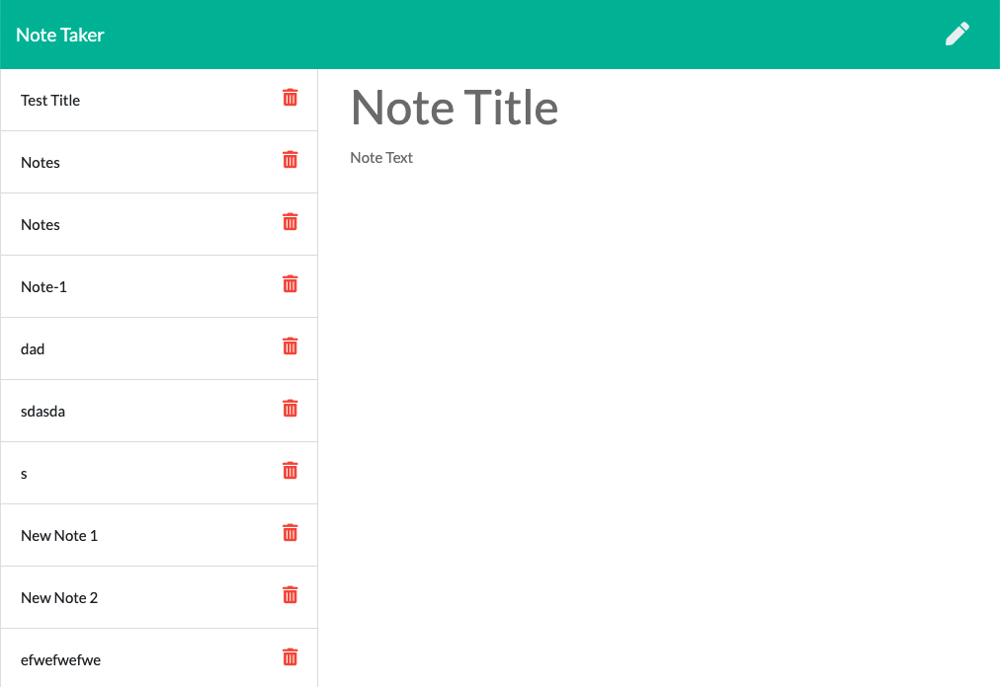

  # Note Taker

  ## Description 
  An app that will take in a user's input and save it to a note
  

  ## Tables of Contents
  * [Installation](#installation)
  * [Usage](#usage)
  * [Questions](#questions)
  
  ## Installation 
* npm init --y
* npm install express

  ## Usage
  This project can be used to take notes/reminders
  
  ## Contributing
  N/A

  ## Questions
  For any questions please reach out to 
  github: [celinalou92](https://github.com/celinalou92)
  email: celinalouissaint@gmail.com

  